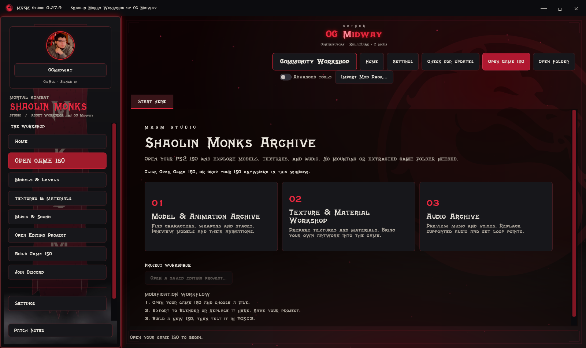

# Mortal Kombat Shaolin Monks Modding Tool by OG Midway

**MKSM Studio — by OGmidway, RelaxDirk & Z mods**

Explore the game. Work with its characters and animations. Build a separate modded ISO to test your changes.

[**Download for Windows**](https://github.com/OGmidway/Mortal-Kombat-Shaolin-Monks-Modding-Tool/releases/latest) · [Start here](docs/GETTING_STARTED.md) · [Feature checklist](docs/FEATURES.md) · [Roadmap](docs/ROADMAP.md) · [Previous builds](docs/PREVIOUS_BUILDS.md) · [Report a problem](https://github.com/OGmidway/Mortal-Kombat-Shaolin-Monks-Modding-Tool/issues)

## 1. What is MKSM Studio?

MKSM Studio is a Windows application for researching and modifying **Mortal Kombat: Shaolin Monks for PlayStation 2**. Open your own game ISO directly, browse supported resources, preview textured characters and their original skeletons, play native animations, export rigged GLB data for Blender and compatible 3D tools/engines, and collect supported edits in a project. Build ISO writes a **new ISO** and can launch it in PCSX2.

You do not need to mount or unpack the ISO to begin. You do need your own game files. The download does not contain the game, a BIOS, character assets, or an emulator.

This is an independent, experimental modding tool. The best-tested workflows use the researched **USA PS2 revision**. Support for one resource or revision does not establish support for every version of the game.

## 2. Current release: 0.27.5

**Community Workshop:** browse character replacements, download them into your editing project, subscribe for version comparisons on refresh, and publish your own native character packages through GitHub. Creator uploads appear without an approval queue. OGmidway's authenticated owner account can remove any listing; other creators manage only their own. [Workshop guide](docs/COMMUNITY_WORKSHOP.md).

**Opening movie included:** the converted opening movie is bundled and starts on first launch. The default movie needs no ISO extraction or FFmpeg. Saved off/volume choices are preserved; selecting another movie previews it immediately.

**An archive-focused MKSM interface:** aged-metal frames, bundled MK4 title lettering, responsive archive cards and automatic scaling on large windows. Home is available from the left navigation and the library. Instructions and file details keep a readable standard font.

**Volume and menu feedback:** clear 0-100% sliders, larger handles, one-percent buttons and live background-volume preview. Automatic hover/select sounds play only on Home; Settings and asset views stay quiet. Join Discord is directly below Build game ISO.

**Volume and menu feedback:** clear 0-100% sliders, larger handles, one-percent buttons and live background-volume preview. Automatic hover/select sounds play only on Home; Settings and asset views stay quiet. Join Discord is directly below Build game ISO.

**Audio ready at startup:** the menu soundtrack is packaged as MP3; short cursor/select effects use PCM WAV and Windows sound playback. Settings includes test-sound buttons and a shortcut to the Windows volume mixer.

Choose **Game music**, **Opening movie audio**, or **Off** independently from the video. Hide the dragon separately. The movie keeps playing through model, texture and other asset previews. Playback also continues when you switch apps by default; that behavior has its own switch.

Custom **SFD conversion requires FFmpeg**; MP4/WMV can be selected directly. The included default opening movie is ready to play. Startup update checks prompt only for newer signed releases. [Settings guide](docs/SETTINGS.md).

**Character memory fixes remain experimental research, not enabled in this release.** A successful Studio preview does not guarantee an oversized replacement will load in game. [Verified findings and remaining work](docs/ENGINE_RESEARCH.md).

### Existing Blender workflow (Bridge 0.25.1)

**New to character swaps? [Start with the simple Blender guide](docs/CHARACTER_START_HERE.md).** [Blender Bridge 0.25.1](https://github.com/OGmidway/Mortal-Kombat-Shaolin-Monks-Modding-Tool/releases/download/v0.25.6/MKSM-Blender-Bridge-0.25.1.zip) adds **Set up game textures (keep more detail)**. Automatic mode uses multiple original slots; choose two or three atlases if you want fewer textures. Original weights stay unchanged, and textures used by kept native meshes are protected. Install the add-on separately; The application is now 0.27.5.

**New in Bridge 0.25.1:** optional **Clean weights on export**, plus **Preview cleaned weights on a copy** and a weight-change report. This handles triangles that touch more than three bones after topology changes. Originals stay untouched. A per-vertex removal limit prevents unexpectedly large changes; default 25%. This does not fix or bypass game memory limits. [Cleanup steps](docs/CHARACTER_START_HERE.md#reduced-polygons-or-changed-geometry).

**Texture preparation:** the new helper copies/resizes existing color images and preserves their UV layouts when they fit separate slots. It packs image rectangles and remaps copied UVs when combining textures; it replaces the old one-atlas bake. [Follow the steps](docs/CHARACTER_START_HERE.md#4-make-the-textures-ready). This does not raise native texture limits or resolve the separate Liu Kang loading-freeze investigation.

The weapon/object visibility fix, hex transfer, animation imports and character draw-batch fixes remain included. Automatic preparation is experimental: review native palette conversion, seams, texture detail and any shared attachment textures, then test in-game.

**Character replacement milestone:** after the 0.25.2 mesh fix, Kratos replacing Reptile **6732** was reported fully visible and moving in-game. The fix is part of the shared importer, so other compatible replacements use the same workflow. This does not guarantee an untested CJ or other model will need no preparation.

[Full release notes](CHANGELOG.md) · [What has been tested](docs/VALIDATION.md) · [Remaining work](docs/ROADMAP.md)

## 3. Download and open

1. Open **[Releases](https://github.com/OGmidway/Mortal-Kombat-Shaolin-Monks-Modding-Tool/releases/latest)**.
2. Download **MKSM-Studio-0.25.6-win-x64.zip** (or the newest equivalent Windows ZIP).
3. Extract the entire ZIP into a regular folder you can write to, such as `Documents/MKSM Studio`. Do not run it from inside the ZIP.
4. Double-click **MKSM Studio.exe**, recognizable by its gold dragon icon.
5. Click **Open game ISO** and select your Shaolin Monks PS2 ISO.

The Windows x64 runtime is included. Blender and PCSX2 are optional, separate applications. Download **MKSM-Blender-Bridge-0.25.1.zip** separately for the Blender editing workflow.

**Use the Windows download under release Assets.** GitHub's automatic **Source code (zip/tar.gz)** downloads contain this documentation repository, not the application.

## 4. Pick a workflow

| I want to… | Start here |
|---|---|
| Follow simple steps to put a new character in-game | [Character swaps: start here](docs/CHARACTER_START_HERE.md) |
| Learn the interface and camera controls | [Getting started](docs/GETTING_STARTED.md) |
| See what works now | [Feature checklist](docs/FEATURES.md) |
| See completed milestones and remaining tasks | [Roadmap](docs/ROADMAP.md) |
| See what was tested in the tool versus in-game | [Validation record](docs/VALIDATION.md) |
| Export a character with its skeleton, weights, textures and UVs | [Models and Blender](docs/MODELS_AND_BLENDER.md) |
| Automatically prepare opaque character materials/UVs | [Automatic material preparation](docs/MODELS_AND_BLENDER.md#automatic-material-preparation) |
| Replace character geometry or make shape edits | [Models and Blender](docs/MODELS_AND_BLENDER.md#returning-a-character-to-the-game) |
| Play/export clips, import a new Blender action, or replace a native BIN bank | [Animation Lab](docs/ANIMATIONS.md) |
| Replace a weapon/object, including 0443 over 0121 | [Weapons and objects](docs/WEAPONS_AND_OBJECTS.md) |
| Copy or write specific hex byte ranges | [Hex transfer](docs/HEX_TRANSFER.md) |
| Use separate animations on one character in Godot 4 | [Godot guide](docs/GODOT.md) |
| Replace music/voices and set native ADX loop points | [Audio workshop](docs/AUDIO.md) |
| Replace an image or inspect native files | [Textures, audio and inspection](docs/ASSETS_AND_INSPECTION.md) |
| Save edits, rebuild an ISO and launch PCSX2 | [Projects and game testing](docs/PROJECTS_AND_TESTING.md) |
| Install a newer version from inside the app | [Updates and troubleshooting](docs/UPDATES_AND_HELP.md) |
| Find an older version for comparison or recovery | [Previous builds](docs/PREVIOUS_BUILDS.md) |

## 5. Feature checklist

Checked items are implemented for supported data. They do not mean every game revision or every possible edit has been tested.

- [x] Open an ISO directly or browse an extracted game folder.
- [x] Preview supported textured models, levels and original skeletons.
- [x] Orbit, pan, zoom and fly around the 3D preview.
- [x] Export rigged GLB characters organized by texture, with UVs and weights.
- [x] Play and scrub supported native animation clips on the selected rig.
- [x] Save one clip or an organized bank of individual clip folders.
- [x] Export animation-only GLBs without repeated character geometry.
- [x] Return supported Blender character geometry, UVs, weights and material images through native import.
- [x] Prepare opaque character textures on copies using multiple native slots or fewer atlases in Blender Bridge 0.25.1.
- [x] Validate replacement geometry against the researched three-bone-per-triangle/draw-batch limit.
- [x] Import newly authored animation keys, choose between GLB actions and use a new duration.
- [x] Verify complete original rigs when Blender exports omit MKSM custom metadata.
- [x] Import native animation BIN banks, choose standalone-bank destinations and inspect animation hex/strings.
- [x] Convert eligible packed animation to higher precision; identify clips already using it.
- [x] Copy/write chosen hex bytes or 16-byte lines without changing the destination resource size.
- [x] Experimental rigid weapon/object replacement with Blender GLB, or game-model/texture copying.
- [x] Replace supported ADX audio, set exact loop points and rebuild its sound collection.
- [x] Stage edits automatically in supported import workflows and save/reopen a project.
- [x] Build a separate ISO, with optional PCSX2 boot, even when no changes were made.
- [x] Relocate supported rebuilt resources when their file size grows or shrinks.
- [x] Check GitHub for newer signed updates, install/relaunch and clean up old updater-created EXEs.
- [x] Keep published older versions accessible through the Previous Builds archive.
- [ ] Arbitrary texture resizing, including a general 4096 × 4096 in-game workflow.
- [ ] Broader verified geometry, texture-memory and resource-size budgets. Hardware limits still apply.
- [ ] Automatic compatibility with any character rig, game revision or animation bank.
- [ ] Complete gameplay validation of every rebuilt character and animation.

See the [full checklist](docs/FEATURES.md) for individual controls and supported boundaries, and the [roadmap](docs/ROADMAP.md) for the remaining research.

## 6. Previous builds and version history

**[Browse Previous Builds](docs/PREVIOUS_BUILDS.md)** for older Windows downloads, their release notes and known reasons to prefer the current version. Published files stay in their original GitHub releases; the archive index is refreshed during release packaging. The newest stable release remains the target of **Check for updates**.

Older builds are for comparison/recovery. They can lack later native-format fixes. Extract an older ZIP into a separate folder and keep backups of your projects. Local updater cleanup removes generated backup EXEs after a successful update; it does not remove the GitHub build archive.

## 7. Updates and source availability

The application checks for a newer release when opened. **New update available** appears only when a verified release has a higher version number. Choose **Install update** to download, verify, install and reopen the application. Save pending project edits when prompted. Failed checks do not prevent offline use. The EXE-only updater does not refresh old offline guide files; use the online guides or download the newest complete ZIP. Documentation can also receive corrections between application releases.

This public repository contains documentation and release downloads. **The main application's C# source, build projects and debug symbols are not distributed here.** The optional Blender bridge is a separate Python add-on and is readable by design. A compiled executable is not a guarantee against reverse engineering.

## 8. Credits and support

**Tool authors: OGmidway, RelaxDirk & Z mods.** See [Credits and notices](docs/CREDITS.md) for research references, runtime licenses and dragon artwork attribution.

For a useful bug report, include the tool version, game region/revision, resource ID, steps to reproduce, and exact error. Share a screenshot or text report where helpful; do not upload an ISO, BIOS or extracted game archive. See [support details](docs/UPDATES_AND_HELP.md#reporting-a-problem).

Mortal Kombat and Shaolin Monks belong to their respective rights holders. This project is not an official game release.

## Community Mod Packs

Share multiple replacements in one download and apply them together before rebuilding. [Create and install a mod pack](docs/MOD_PACKS.md).
