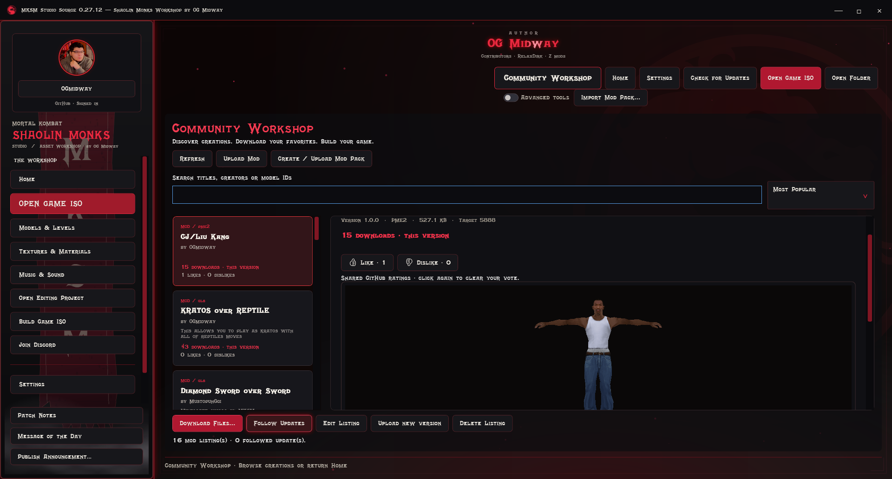

## Studio 0.27.14

- Fixed blank Workshop cards after resizing, scrolling and refreshing. Divider dragging previews the new width; cards reflow when released. The model camera stays steady.
- Workshop checks for new listings in the background after opening it: every 30 seconds signed in, every 2 minutes as a guest. Failed requests retain the library and back off. Selection, scroll anchor and unchanged previews survive refresh. Download totals refresh separately every 5 minutes, or on manual Refresh.
- Announcements check at startup, on returning to the app and every 10 seconds. Publishing updates the publisher's view immediately. GitHub caching and network conditions can still delay other clients; older Studio versions retain their old intervals. Messages remain once-per-publication and can be reopened.
- Background SFD/movie is off by default, including a one-time reset of the old default. The dragon and particles remain. Enable video in Settings if desired. Disabled media releases its decoder; muted menu music is not opened.
- Character replacement adds **Original head / hat / attachments…**. Explicitly hide unwanted original rigid parts while retaining skeleton and skinned surfaces. Selection persists in GLB/package exports and can be changed. Review the preview and test in game; this does not claim to fix every head texture or unsupported attachment.

# Community Workshop

[Home](../README.md) · [Characters](CHARACTER_START_HERE.md)

## Share a mod — no ISO required

1. Click **Community Workshop** at the top right. It opens inside Studio; no game needs to be open. **Home** returns to the start page. Returning to Workshop keeps your search, sorting, selected mod and scroll position.
2. Use the GitHub profile box on the left to sign in. Studio opens GitHub and shows a code with Copy Code and Copy Link buttons. Authorize GitHub CLI in your browser.
3. Click **Upload Mod** and choose `.glb`, `.bin`, `.pme2` or `.mksmcharacter`.
4. Enter a title and description. Add your author name and choose its glow color. You may include suggested model/texture IDs and game revision notes, but an ISO is not required.
5. Optionally attach a texture BIN and a PNG/JPG picture. Click **Publish publicly**.

Your file is shared unchanged. Workshop does not compile, convert, run, or test it against a game. Import requirements are checked later when a downloader chooses to install it. Individual files are limited to 200 MB. Raw GLBs get a basic header check; native BIN uploads are preserved as supplied.

Files are published in your public `MKSM-Workshop-Mods` GitHub release repository. The official Studio repository stores the listing. An existing private creator repository is never made public automatically. New listings appear without an approval queue.

## Browse and download

The main navigation and Settings stay available while browsing. **Ctrl+F** focuses Workshop search; **F1** returns Home. Model previews support rotation and panning; the mouse wheel scrolls the details rather than zooming the model.

Select a mod card to see its author, title, description, picture or model preview. The verified GitHub uploader is shown separately from the creator's custom display name.

Without a picture, Studio downloads the file into its preview cache and tries to display its stored rest pose. GLB triangle meshes with embedded images, supported native character BINs and MKSM character packages are supported. It does not force every model into a T-pose. Unsupported, compressed or very large previews may be unavailable; the file can still be downloaded.

Click **Download Files...**, choose a folder, and Studio saves the original file, optional companion texture BIN and a readme in a new mod folder. It verifies download checksums. This does not change your game or editing project.

To install later, open your ISO in Studio, select the destination character, and use Import character for GLB/packages or Replace game file for native BINs. Import companion textures into the intended texture set. Save your project and build your ISO when ready.

## Edit or delete your own mod

Sign in with the account that uploaded it. **Edit Listing** changes the title, description, author name, glow and suggested destination without uploading the file again. **Upload new version** replaces the files or picture and requires a higher version number. Attach companion textures again when publishing a new version if they are still needed.

**Delete Listing** removes your listing from the Workshop by closing its GitHub issue. This does not erase files already downloaded or delete your separate GitHub release assets. Other users cannot edit or remove your listing. OGmidway retains owner moderation controls.

## Sign in once

The bordered account box appears at the top left of the application, including the homepage and integrated Workshop. Update dialogs reuse the same account. Connected views say **GitHub · Signed in as username** and **Already signed in**. GitHub CLI keeps credentials in its normal credential store; Studio restores the account when starting. Public application updates do not require login. Private source updates require an invited account.

## Subscriptions and compatibility

Subscribe marks a mod on this computer. Refresh detects changed file hashes; it does not install anything automatically. Old packaged listings remain readable. Raw-file listings require Studio 0.27.3 or newer.

The catalog reads up to the newest 1,000 open GitHub entries. GitHub availability and rate limits apply. Sharing a file does not guarantee game compatibility. User-reported beta native imports have succeeded; other models need their own testing.

## Validation

25 integrated checks cover no-ISO raw uploads, original-file downloads, companion textures, rest-pose previews, glow settings, creator-only edit/delete permissions and the shared account box. Publishing and mutations were tested with a mocked service; no sample mod was posted publicly. The earlier source-channel upgrade from 0.27.0 to 0.27.1 was verified through download, signature checks, extraction and application launch.

The left navigation now has a full metal-style enclosure and a red perimeter glow. The existing Settings > Glow option controls the aura.

## Multiple files in one mod

Use **Create / Upload Mod Pack** to share several mapped replacements. With your game open, **Apply Pack to Project** checks and stages the complete group after your review. [Mod pack instructions](MOD_PACKS.md). Single-file downloads remain manual.

## Studio announcements

In the private source build, OG Midway's verified owner account can use **Publish Announcement** in the sidebar. Choose Message of the Day or Patch Notes, type a title and message, preview it, then **Publish to All Builds**. Other accounts cannot publish. The public build has no publisher control.

New messages display once on the next launch, or normally within 10 seconds (network and GitHub caching can delay delivery) while the app is active and no editing dialog is open. Close the message after reading; its ID is saved. The sidebar button remains available to review it. Offline checks never block editing. A newer publication replaces the current announcement and gets a new notification ID.

Use arrow keys to scroll message text, Enter or Space on Continue to dismiss, and Esc to go back. Settings uses Tab/Shift+Tab to move, Space to activate the focused control, and Enter to save.

## File-download totals (Studio 0.27.8)

Every mod card and detail page shows the main release file’s GitHub download count for its currently published version. Refresh reads release statistics in batches; results are cached for two minutes to reduce requests. Missing files, unavailable GitHub responses and rate limits show **Downloads unavailable** without blocking the listing or its download button.

Counts include direct GitHub downloads and the first uncached file fetch used for a 3D preview. Copying a cached file again does not add a GitHub download. Cover images and companion textures are excluded. These are file-transfer totals, not unique people or lifetime totals across previous versions of a mod.

## Browse and rate creations (Studio 0.27.9)

Choose **Most Popular** to rank by likes minus dislikes, then likes, current-version downloads and latest update. **Most Downloaded**, **Recently Updated** and **My Uploads** are also available. Search combines with the selected ordering. Ratings belong to a listing, so they remain when its creator publishes a new file version; file-download totals still describe the current version.

Sign in with GitHub, then use **Like** or **Dislike**. The tool saves your thumb reaction on the listing's GitHub issue and restores your choice when you return. Switching removes your previous thumb; clicking the selected thumb again clears your vote. Existing reactions from other accounts are not changed. GitHub also permits rating directly on the listing page. Counts and choices refresh when requested; unavailable GitHub responses never invent totals.

**Follow Updates** (previously Subscribe) compares file versions when you refresh. It does not install or download anything automatically. Use **Download Files** when ready.

Model portraits: drag to rotate; Shift-drag to pan. The mouse wheel scrolls the details page without zooming the model. Main Studio model editing retains full zoom controls.

## Share a saved editing project (0.27.13)

Choose **Upload Mod**, then select your `.mksmproject`. Studio verifies payload sizes/hashes and converts archive edits into the existing `.mksmmodpack` format; the original project remains unchanged. Downloaders can apply the pack into their own project and save it. No ISO or gameplay test is required to publish.

The package uses schema 1, accepted by the 0.27.12 reader and later compatible readers. This does not make every old or future application support new features. Projects with SFD movie edits require 0.27.13 to reopen; they cannot be represented by older Workshop packs and sharing reports that explicitly. Unknown schema versions, replacement modes or extra payloads are rejected. Existing archive-only project saves retain version 2, while current Studio reads project versions 1, 2 and 3. Recipients still need the matching game revision and valid resource destinations.

## Adjust Workshop layout (0.27.13)

Drag the thin crimson divider between mod cards and preview left/right. Drag the top crimson strip up/down to adjust header spacing. Credits and navigation remain above the workspace; minimum pane sizes keep content usable. Saved settings retain these layout choices.

## Latest-version access

Studio 0.27.13 and later check signed release metadata before opening Workshop and performing online operations. Update to the latest release for your public or private-source channel. If the version check cannot finish, reconnect and retry. Local project editing and downloaded packs remain available. Previously distributed older builds cannot be remotely disabled by this client-side policy.

Widen the mod library with its center divider to get two or more compact card columns. Narrow widths use one column. Only visible rows and nearby cards are realized; off-screen cards are recycled.
